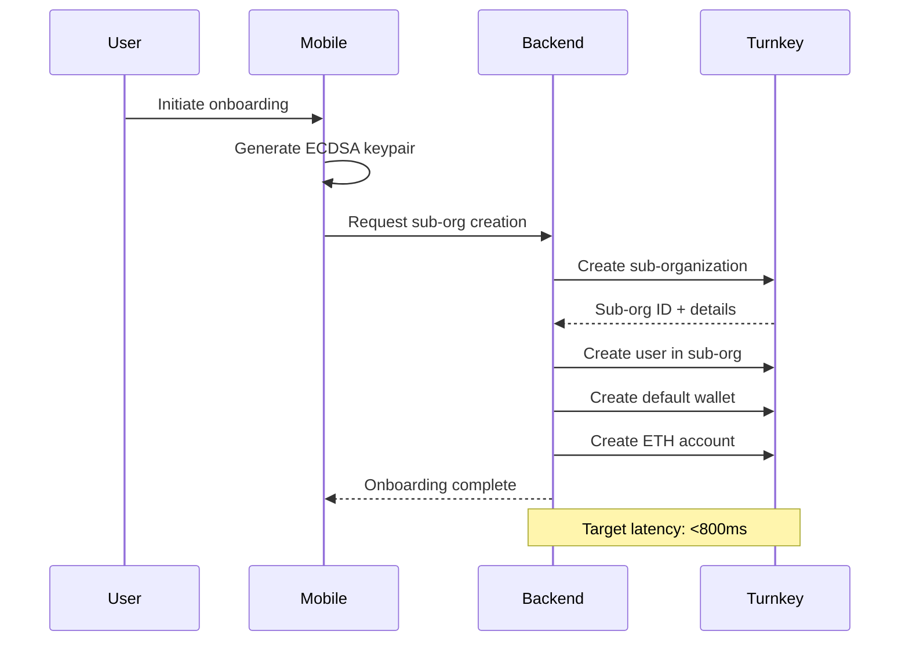

# Turnkey Integration Architecture

## Overview

This implementation provides a secure, scalable architecture for integrating with Turnkey's wallet infrastructure, emphasizing **user custody** and **decentralized request authentication**.

## Key Design Principles

### 1. User-Controlled Request Stamping
**Users of each organization stamp their own requests by themselves.**

- Each mobile user generates and holds their own ECDSA P-256 keypair
- Users sign their own Turnkey API requests client-side using their private key
- No server-side request stamping - eliminates single points of failure
- True non-custodial architecture where users control their cryptographic operations

### 2. One Sub-Organization Per User
```
Parent Organization (Server)
├── User 1 Sub-Org (with User 1's passkey as root authenticator)
├── User 2 Sub-Org (with User 2's passkey as root authenticator)  
└── User N Sub-Org (with User N's passkey as root authenticator)
```

**Benefits:**
- Complete user isolation and security
- Independent wallet management per user
- Simplified access control (quorum=1 per user)
- Scalable billing model aligned with Turnkey's pricing

### 3. Authentication Flow
```
Mobile App → Passkey/FIDO2 → Turnkey Session Creation → Encrypted Credential Bundle
```

- **Primary Auth**: Passkey/WebAuthn for biometric authentication
- **Alternative Auth**: Google Auth as separate IdP (optional)
- **Session Management**: HPKE-encrypted credential bundles (15 minutes read-write, 1 hour read-only)
- **No JWT Verification**: Sessions use encrypted credential bundles, not JWTs
- **No Recovery Flows**: Users must maintain access to their passkey

## Technical Components

### Core Services

#### 1. Crypto Module (`lib/be_votis_wallet/services/turnkey/crypto.ex`)
Production-ready cryptographic utilities:

- **ECDSA P-256 Key Generation**: For API authentication
- **HPKE Decryption**: Decrypts read-write session credential bundles
- **Request Stamping**: Signs API requests (used client-side)

#### 2. Session Manager (`lib/be_votis_wallet/services/turnkey/session_manager.ex`)
GenServer-based session management:

- **Proactive Session Refresh**: Prevents token expiration
- **In-Memory Caching**: ETS-based storage for performance
- **Automatic Cleanup**: Handles expired sessions
- **Telemetry Integration**: Monitors session lifecycle

#### 3. HTTP Client Behavior (`lib/be_votis_wallet/services/http_client_behavior.ex`)
Configurable HTTP interface:

- **Finch-based Implementation**: Production HTTP client
- **Mock Support**: For testing environments
- **Rate Limit Handling**: Graceful handling of 429 responses
- **Retry Logic**: Exponential backoff for transient failures

### Async Job Processing (Oban)

**Use Oban for:**
- Rate-limit retry queuing
- Balance synchronization
- Background analytics
- Webhook processing

**Do NOT use Oban for:**
- Core wallet operations (immediate user feedback required)
- Authentication flows
- Transaction signing
- Account creation

### Error Handling Strategy

#### Fail Fast Operations (No Retries)
- Wallet creation
- Transaction signing  
- Account creation
- Authentication requests

*Rationale: Users are actively waiting - provide immediate feedback*

#### Retry Operations (Background Jobs)
- HTTP 429 rate limits
- 5xx server errors
- Network timeouts
- Session credential bundle decryption

*Rationale: These are transient issues that benefit from exponential backoff*

## Mobile Client Architecture

### Client-Side Responsibilities
1. **Key Generation**: Generate ECDSA keypairs locally
2. **Request Stamping**: Sign all Turnkey API requests
3. **Passkey Management**: Handle biometric authentication
4. **Session Handling**: Manage encrypted credential bundles and refresh

### Server-Side Responsibilities  
1. **Sub-Organization Management**: Create/manage user sub-orgs
2. **Session Coordination**: Facilitate session creation and credential bundle decryption
3. **Background Jobs**: Handle async operations via Oban
4. **API Orchestration**: Coordinate multi-step operations

## Onboarding Flow



## Security Considerations

### Key Management
- **Client-Side Generation**: All user keys generated on device
- **Hardware Security**: Leverage mobile secure enclaves where available
- **No Key Escrow**: Backend never sees user private keys
- **Passkey Backup**: Platform-managed backup (iCloud, Google)

### Request Authentication
- **Per-Request Signing**: Every API call authenticated individually
- **Replay Protection**: Timestamps and nonces prevent replay attacks
- **Transport Security**: TLS 1.3 for all communications
- **Certificate Pinning**: Mobile apps pin Turnkey's certificates

### Session Security
- **Short Expiry**: 15-minute read-write, 1-hour read-only tokens
- **Automatic Refresh**: Proactive renewal before expiration
- **Secure Storage**: Platform keychain storage on mobile
- **Revocation**: Server-side session invalidation capability

## Production Considerations

### Performance Targets
- **Onboarding Latency**: <800ms end-to-end
- **Transaction Signing**: <200ms client-side
- **Session Refresh**: <100ms with caching
- **Background Jobs**: <5 second queue processing

### Monitoring & Observability
- **Session Metrics**: Creation, refresh, expiry rates
- **Error Tracking**: Categorized by operation type
- **Performance Monitoring**: P95 latency tracking
- **Security Events**: Failed authentications, suspicious patterns

### Scalability
- **Horizontal Scaling**: Stateless backend services
- **Connection Pooling**: Finch with optimal pool sizes
- **Cache Strategy**: ETS for sessions, Redis for shared state
- **Database Optimization**: Read replicas for analytics

## Development Setup

### Prerequisites
1. **asdf Version Manager**: See `ASDF_SETUP.md` for installation
2. **Erlang 28.0.2**: Via asdf
3. **Elixir 1.18.4-otp-28**: Via asdf
4. **PostgreSQL**: Local development database

### Quick Start
```bash
# Install language versions
asdf install

# Install dependencies  
mix deps.get

# Run tests
mix test

# Start development server
mix phx.server
```

### Testing Strategy
- **Unit Tests**: Comprehensive crypto module coverage
- **Integration Tests**: End-to-end flows with mocked Turnkey
- **Property Tests**: Cryptographic operations validation
- **Load Tests**: Session management under concurrent load

## Future Enhancements

### Short Term
1. **Session Management Enhancement**: Improve session lifecycle monitoring
2. **Rate Limiting**: Implement client-side rate limiting
3. **Metrics Dashboard**: Real-time session monitoring
4. **Error Recovery**: Improved error handling flows

### Long Term
1. **Multi-Chain Support**: Beyond Ethereum
2. **Advanced Cryptography**: Post-quantum preparations
3. **Federated Identity**: Cross-platform authentication
4. **Analytics Platform**: User behavior insights

## References
- [Turnkey Documentation](https://docs.turnkey.com)
- [FIDO2/WebAuthn Specification](https://webauthn.guide)
- [HPKE RFC 9180](https://tools.ietf.org/rfc/rfc9180.html)
- [Elixir OTP Design Principles](https://erlang.org/doc/design_principles/des_princ.html)
